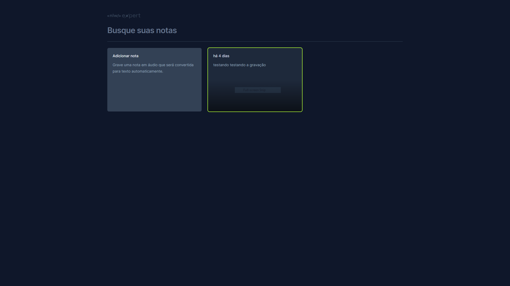
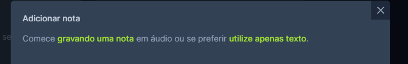

# NLW 14 - Trilha React - Sistema de Notas

Site responsivo de notas, onde é possível escrever uma nota pelo teclado, ou pela fala através do microfone. As notas são armazenadas pelo browser, onde mesmo que o navegador seja fechado, as notas continuam armazenadas no cache.



<hr>

## :computer: Tecnologias Usadas
&nbsp;
&nbsp;
&nbsp;
&nbsp;
&nbsp;
&nbsp;

## ⚙ Configurações Iniciais
1. Instale as dependências do projeto com o comando abaixo:
```bash
npm install
```

2. Execute o servidor **vite** com:
```bash
npm run dev
```

3. Abra o navegador na URL: *http://localhost:5173*.

## 💿 Como Executar

A aplicação consiste em criar **notas** através do teclado ou do microfone.

Clique no 1º card:


Escolha de qual forma você deseja escrever na nota:

